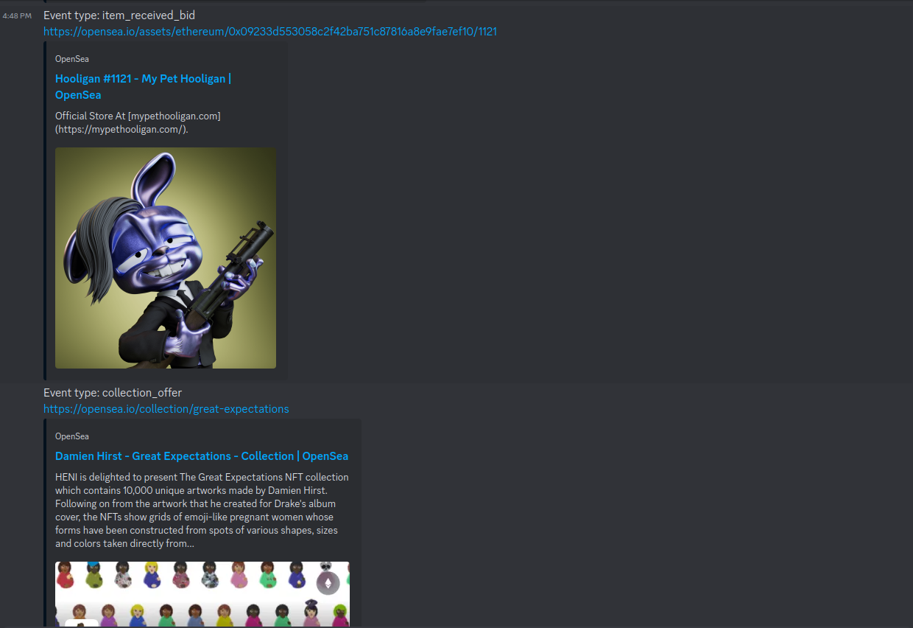

# SeaDisc

A Discord bot that listens to events from OpenSea on subscribed collections and sends direct messages to users.

## Overview

The OpenSea Discord Bot is designed to provide real-time notifications to Discord users about events related to their subscribed NFT collections on OpenSea. The bot connects to the OpenSea WebSocket stream, monitors specified events, and sends notifications to users based on their subscription preferences.

## Features

- Real-time event notifications from OpenSea.
- Subscription management for NFT collections.
- Direct message notifications to Discord users.

## Prerequisites

Before running the bot, ensure you have the following prerequisites installed:

- Node.js (v18.17.1)
- Discord.js (14.14.1)
- Other dependencies...

## Installation

Follow these steps to install and set up the OpenSea Discord Bot locally:

```bash
# Clone the repository
git clone https://github.com/PrantaDas/SeaDisc

# Change into the project directory
cd SeaDisc

# Install dependencies
pnpm install
```
## Configuration
Configure the bot by creating a .env file with the following variables:
```sh
BOT_TOKEN=your_bot_token
OPENSEA_API_KEY=your_opensea_api_key
```

## Usage
```sh
pnpm dev
```
## Commands
* `/ping`: Replies with "pong."
* `/hello`: Greets the user.
* `/subscribe <collection>`: Subscribe to receive events from a specific collection.
* `/unsubscribe <collection>`: Unsubscribe from a collection.
* `/collections`: List all subscribed collections.

## Contributing
Explain how others can contribute to your project. Include guidelines for code style, testing, and submitting pull requests.

## Acknowledgements

I would like to express my sincere gratitude to [Rakibul Yeasin](https://github.com/dreygur) for their invaluable support, guidance, and contributions to the development of this Discord bot. Their expertise, feedback, and dedication played a crucial role in shaping the project.

[Rakibul Yeasin](https://github.com/dreygur) demonstrated an exceptional level of knowledge in bot development and automation, providing valuable insights that significantly enhanced the functionality and efficiency of the bot. Their willingness to share knowledge and answer questions has been instrumental in overcoming challenges and improving the overall quality of the codebase.

I am truly grateful for [Rakibul Yeasin](https://github.com/dreygur)'s collaborative spirit, commitment to excellence, and passion for the project. Their positive attitude and willingness to go above and beyond have made this collaborative journey a rewarding and enriching experience.

Thank you, [Rakibul Yeasin](https://github.com/dreygur), for being an integral part of this project and for your continuous support. Your contributions have left an enduring mark, and I appreciate the opportunity to work alongside such a talented and dedicated individual.


## Demo:
<div aligin="center">

</div>

#### **Made with :heart: by  Pranta Das**